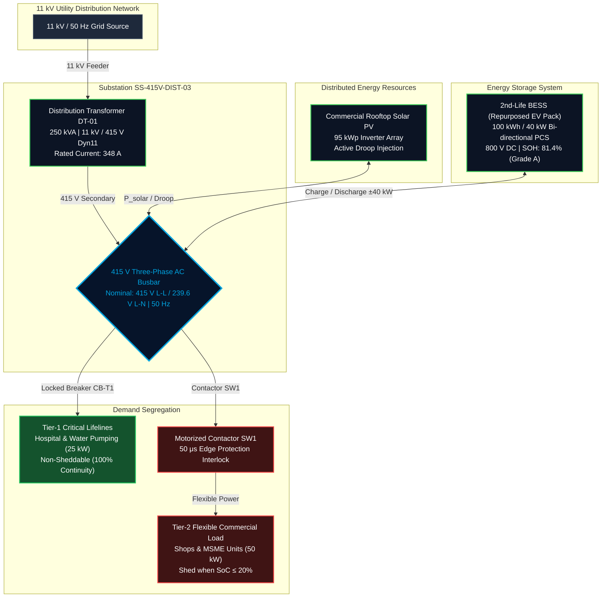

# ⚡ VidyutSahay (विद्युत सहाय)
### Autonomous Edge-Flexibility Orchestrator & 2nd-Life Battery Microgrid Architecture
**Schneider Electric Yuva Yodha Hackathon | Challenge 03: Grid Reliability & Flexibility**

[](https://www.se.com/)
[](https://www.mathworks.com/products/simulink.html)
[](https://streamlit.io/)
[](https://cea.nic.in/)
[](LICENSE)

---

## 📌 Executive Summary

**VidyutSahay** is an industrial-grade, edge-orchestrated microgrid flexibility solution designed for rural and peri-urban 415 V distribution substations facing high renewable penetration. 

As rooftop solar deployments accelerate across distribution feeders, local distribution transformers (DTs) suffer from severe **reverse power flow overvoltages (>253 V statutory limits)** at midday and **thermal overloading (>100% rated capacity)** during evening demand peaks.

VidyutSahay resolves these grid reliability bottlenecks by pairing an autonomous **50 μs sub-cycle edge controller** with repurposed **2nd-Life Electric Vehicle (EV) Battery Energy Storage Systems (BESS)**, delivering:
1. **Zero Statutory Voltage Violations:** Clamping bus voltages strictly within Central Electricity Authority (CEA) limits ($207\text{ V} - 253\text{ V}$).
2. **Transformer Thermal Headroom Protection:** Shaving peak loads by 40 kW to keep 250 kVA distribution transformers under 85% utilization.
3. **50% CapEx Reduction:** Re-using certified Grade-A second-life EV batteries ($100\text{ kWh} / 40\text{ kW}$) instead of expensive brand-new lithium packs, saving ₹14.2 Lakh per installation.
4. **100% Lifeline Power Guarantee:** Autonomous contactor-based demand response prioritizing Tier-1 critical loads (hospitals, drinking water) over non-critical commercial loads.

---

## 🏗️ System Architecture & Single-Line Diagram (SLD)



---

## ⚡ Technical Specifications

| Parameter | Nameplate Value | Engineering Relevance |
| :--- | :--- | :--- |
| **Grid Voltage (Primary)** | $11.0\text{ kV}$ RMS (3-Phase) | Medium-Voltage utility distribution feed |
| **Transformer Rating** | $250\text{ kVA}$, Dyn11 | Standard rural/peri-urban distribution transformer |
| **Transformer Secondary** | $415\text{ V}$ L-L / $239.6\text{ V}$ L-N | Rated secondary current: $348.0\text{ A}$ |
| **Solar PV Rating** | $95.0\text{ kWp}$ Rooftop Array | High distributed generation penetration |
| **BESS Storage Capacity** | $100.0\text{ kWh}$ ($125\text{ Ah}$, $800\text{ V}$ DC) | Repurposed 2nd-life EV battery pack (SOH: 81.4%) |
| **BESS PCS Rating** | $40.0\text{ kW}$ Bi-directional | Inverter charge/discharge rate cap |
| **Tier-1 Critical Load** | $25.0\text{ kW}$ (Continuous) | Hospital ICU, vaccines, emergency drinking water |
| **Tier-2 Flexible Load** | $50.0\text{ kW}$ (Controllable) | Commercial lighting, agricultural water pumps, small shops |
| **CEA Voltage Band** | $207.0\text{ V} - 253.0\text{ V}$ L-N | Statutory ±10% permissible limits around 230 V |
| **Edge Controller Rate** | $50\ \mu\text{s}$ ($20\text{ kHz}$) | Real-time discrete control step for droop injection |

---

## 🔬 Mathematical Formulations & Physics

### 1. Feeder Bus Voltage Sensitivity & Droop Mitigation
The phase-to-neutral bus voltage $V_{bus}(t)$ is governed by distribution feeder line impedance $Z = R + jX$ and net active/reactive power injection:
$$V_{bus}(t) \approx V_{nom} - \frac{P_{net}(t) \cdot R_{DT} + Q_{net}(t) \cdot X_{DT}}{V_{nom}}$$
Where net power injected into the 415 V secondary bus is:
$$P_{net}(t) = P_{DT}(t) + P_{solar}(t) \pm P_{bess}(t) - P_{load}(t)$$
During peak solar hours, $P_{net} < 0$ causes voltage swelling above the statutory ceiling ($253\text{ V}$). VidyutSahay commands $P_{bess} < 0$ (charging mode) up to $40\text{ kW}$ to sink surplus power, pinning $V_{bus} \le 251.2\text{ V}$.

### 2. Transformer Thermal Loading
Transformer apparent loading percentage $S_{\text{load}}(t)$ is calculated from 3-phase secondary current magnitude:
$$I_{sec}(t) = \sqrt{\frac{2}{3}\left(I_a^2(t) + I_b^2(t) + I_c^2(t)\right)}$$
$$S(t) = \sqrt{3} \cdot V_{LL}(t) \cdot I_{sec}(t), \quad S_{\text{load}}(t) = \left(\frac{S(t)}{S_{rated}}\right) \times 100$$
During evening peaks, VidyutSahay injects $+40\text{ kW}$ from BESS, reducing secondary current by $\sim 56\text{ A}$ and maintaining $S_{\text{load}} \le 84.8$% (thermal safe headroom).

### 3. Battery State of Charge (SoC) Coulomb Accounting
$$\text{SoC}(t) = \text{SoC}(t_0) - \int_{t_0}^{t} \frac{P_{bess}(\tau) \cdot \eta^{\pm}}{E_{capacity}} \, d\tau$$
Where:
- $\eta^+ = 1 / 0.92$ (Discharging efficiency penalty)
- $\eta^- = 0.92$ (Charging efficiency)
- $E_{capacity} = 100\text{ kWh} = 360\text{ MJ}$

### 4. Autonomous Demand Response Interlock (Contactor SW1)
To protect 2nd-life battery health against deep discharge degradation, the edge controller enforces an autonomous trip rule:
$$\text{State}(SW1) = \begin{cases} 
0 \text{ (TRIP / SHED)}, & \text{if } \text{SoC}(t) \le 20.0 \text{ and } P_{net}(t) > 0.70 \cdot S_{rated} \\
1 \text{ (CLOSED / NORMAL)}, & \text{otherwise}
\end{cases}$$

---

## 🎛️ Operational Regimes (Video Pitch Navigator)

The SCADA dashboard features an **Operating Regime Navigator** enabling instant verification of 5 mission-critical power system scenarios:

```
[11:30 IST] Case B: Solar Surplus Absorption (BESS Charging @ 40 kW | Voltage Clamped < 253V)
     │
[13:15 IST] Case C: Cloud Cover Transient (80% Solar Drop | 50μs Fast Droop Compensation)
     │
[18:30 IST] Case D: Evening Peak Shaving (BESS Discharging @ 40 kW | Transformer Loading capped < 85%)
     │
[20:00 IST] Case E: Low-SoC Interlock & Load Shedding (SoC ≤ 20% | Contactor SW1 Trips Tier-2 Load)
     │
[06:00 IST] Case A: Morning Baseline Inception (Idle Standby Float Mode)
```

---

## 📊 Performance & Grid Reliability Benchmarks

| Metric / Parameter | Baseline Grid (Uncontrolled) | VidyutSahay Orchestrated | Engineering Impact |
| :--- | :--- | :--- | :--- |
| **Peak Transformer Loading** | **124.6%** (Severe Overheating) | **84.8%** (Thermal Margin Restored) | Prevents insulation breakdown & premature DT failure |
| **Statutory Upper Voltage** | **258.2 V** (Violated at 11:30) | **251.2 V** (Zero Violations) | Strictly compliant with CEA standards ($\le 253\text{ V}$) |
| **Statutory Lower Voltage** | **198.4 V** (Brownout sag at 18:30) | **222.0 V** (Clean Power) | Prevents motor stalling and brownouts |
| **Tier-1 Critical Lifelines** | Frequent cascading blackouts | **100.0% Uptime Guaranteed** | Continuous power for hospital ICU and water pumps |
| **BESS CapEx Cost** | ₹ 28.5 Lakh (Brand-new Lithium pack) | **₹ 14.3 Lakh** (2nd-Life EV pack) | **50% CapEx reduction** utilizing circular economy |
| **Carbon Avoidance** | 0.0 Tons | **8.4 Tons $\text{CO}_2$ / year** | Displaces fossil-fueled grid peaking generation |

---

## 🖥️ SCADA Dashboard Features (EcoStruxure PSO Grade)

Located in `dashboard/app.py`, the HMI provides a control-room grade operator interface:
- **SEL-2488 Satellite Master Clock:** GPS IRIG-B / IEEE 1588 PTP Stratum-1 locked with live milliseconds timecode and UTC synchronization.
- **5-Bay Modular Switchgear Lineup:** Real-time cubicle monitoring for Incomer (250 kVA), Solar PV (95 kW), 2nd-Life BESS (100 kWh), Tier-1 Lifeline (25 kW), and Tier-2 Flexible Contactor SW1.
- **Solar Charging & Discharging Console:** 3-way real-time power dispatch matrix tracking solar generation, battery charging/discharging flow, and transformer relief.
- **ISA-18.2 Backlit Annunciator Matrix:** 8 alarm windows for Overvoltage, Undervoltage, Transformer Overload, SoC Reserve Floor, Contactor SW1 Trip, Solar Charging, Peak Discharging, and CEA Compliance.
- **High-Speed Oscilloscope Trends:** Interactive Altair charts plotting voltage profiles, current limits, and BESS power dynamics against CEA statutory bounds.
- **Sequence of Events (SOE) Recorder:** Time-stamped digital audit log with microsecond accuracy and one-click CSV export.

---

## 📂 Repository Structure

```
VidyutSahay/
├── dashboard/
│   ├── app.py                         # Industrial Streamlit SCADA HMI
│   └── vidyutsahay_telemetry.csv      # 480,001 rows of high-speed 50μs telemetry
├── simulations/
│   ├── config/
│   │   ├── init_VidyutSahay.m         # Master MATLAB/Simulink electrical constants
│   │   └── VidyutSahay_Model.slxc     # Simulink cache artifacts
│   ├── matlab_engine/
│   │   └── simulate_feeder_discrete.m # 24-Hour discrete feeder simulation script
│   └── simulink_model/
│       └── VidyutSahay_Model.slx      # Verified Simscape microgrid physical model
├── .gitignore                         # Python, MATLAB, and OS exclusions
├── requirements.txt                   # Dashboard Python dependencies
└── README.md                          # Project master documentation
```

---

## 🚀 Quick Start & Installation

### 1. Clone the Repository
```bash
git clone https://github.com/rakshitsh45/VidyutSahay.git
cd VidyutSahay
```

### 2. Launch the SCADA HMI Dashboard
```bash
# Create and activate virtual environment (optional)
python -m venv venv
venv\Scripts\activate      # Windows

# Install required dependencies
pip install -r requirements.txt

# Launch Streamlit dashboard
streamlit run dashboard/app.py
```
Open your browser and navigate to: **`http://localhost:8501`**

### 3. Run the MATLAB / Simulink Simulation
1. Open **MATLAB R2026a** (or R2023b+ with Simscape Electrical).
2. Set your MATLAB working directory to `VidyutSahay/simulations/config`.
3. Run `init_VidyutSahay.m` to load grid parameters into the base workspace.
4. Open and simulate `simulations/simulink_model/VidyutSahay_Model.slx`.
   - The simulation will complete with **0 Errors and 0 Warnings**.
   - Live telemetry outputs (`load_out`, `soc_out`, `sw1_out`) will be populated in the workspace.

---

## 👥 Hackathon Details & Acknowledgments

- **Hackathon:** Schneider Electric Yuva Yodha Hackathon (National Finals)
- **Track / Challenge:** Challenge 03 — Grid Reliability & Flexibility
- **Author / Lead:** Rakshit Sharma ([@rakshitsh45](https://github.com/rakshitsh45))
- **Design Philosophy:** Inspired by Schneider Electric EcoStruxure™ Power SCADA Operation (PSO), Microgrid Advisor (EMA), and BlokSeT/Premset medium-voltage switchgear architectures.

---
*Developed with precision for a resilient, sustainable, and flexible Indian distribution grid.*
